# Unified OCR API (Handwriting + General OCR)

An end-to-end line-level OCR service combining a custom **CRNN** (with optimized C++ ONNX Runtime option) for handwriting recognition and **Tesseract** for general printed text fallback. Includes full-page preprocessing (deskew + custom line segmentation) and single-line inference.

---

## Key Features

- **Dynamic Pipeline**: Choose between optimized ONNX (`crnn_onnx`), PyTorch (`crnn`), and `tesseract` on the fly.
- **Page Preprocessing**: Automated line segmentation, deskewing, and adaptive contrast normalization.
- **Production Ready**: Run locally or via a microservice-ready Docker container.
- **Super Light Docker Footprint**: Leverages conditional dependencies to strip container size to a bare minimum.

---

## ⚡ Quick Start with Docker

1. Place your compiled ONNX model at `model_weights/handwriting_recognizer_best.onnx`. *(Optionally, place the PyTorch checkpoint at `model_weights/handwriting_recognizer_best.pth`)*
2. Spin up the API service:
   ```bash
   docker compose up --build
   ```
3. Test the API:
   ```bash
   curl http://localhost:8000/health
   ```
4. Explore interactive API docs at `http://localhost:8000/docs`.

---

## 🔄 Architecture & Internal Flow of Execution

The system uses a pipeline that processes page binarization, aspect rescaling, deskewing, and custom horizontal projection line segmentation before dynamically routing text line images to the appropriate character recognition models (ONNX vs PyTorch vs Tesseract):

```mermaid
flowchart TD
  %% Style Definitions
  classDef api fill:#e0f2fe,stroke:#0284c7,stroke-width:2px,color:#0369a1,font-size:16px
  classDef preprocess fill:#fef08a,stroke:#ca8a04,stroke-width:2px,color:#854d0e,font-size:16px
  classDef model fill:#f3e8ff,stroke:#8b5cf6,stroke-width:2px,color:#6d28d9,font-size:16px
  classDef decode fill:#ffedd5,stroke:#ea580c,stroke-width:2px,color:#c2410c,font-size:16px
  classDef docker fill:#d1fae5,stroke:#059669,stroke-width:2px,color:#065f46,font-size:16px,font-weight:bold

  %% API LAYER (Simple Web Dev part)
  subgraph Web_API ["FastAPI Interface (api/fastapi_app.py)"]
    Endpoint["POST /ocr<br/>(Concurrently OCR Multiple Images)"]:::api
    Endpoint_Single["POST /ocr/single<br/>(Swagger friendly single upload)"]:::api
    Health["GET /health<br/>(Liveness & active hardware check)"]:::api
    Models["GET /models<br/>(Metadata of active weights)"]:::api
  end

  %% TIER 2: DETAILED IMAGE PREPROCESSING PIPELINE
  subgraph Image_Preprocessing ["Page Preprocessing Pipeline (preprocessing/layout_segmenter.py)"]
    Grayscale["Grayscale Conversion<br/>(Eliminate color channels / Normalize luminance)"]:::preprocess
    Rescale["Aspect-Ratio Resizing<br/>(Standardize target width to 2000px)"]:::preprocess
    HoughDeskew["Hough Line Deskewing<br/>(Baselines tilt angle detection -> Affine rotation)"]:::preprocess
    
    subgraph Line_Segmentation ["Horizontal Projection Segmentation"]
      Profile["Horizontal Projection Profile<br/>(Calculate dark pixel density histograms)"]:::preprocess
      BBoxes["Whitespace Thresholding<br/>(Isolate Bounding Boxes for paragraph lines)"]:::preprocess
      Splitter{"Width > 1000px?"}:::preprocess
      LineSplit["Segment Splitter<br/>(Split long lines to match engine dimensions)"]:::preprocess
      
      Profile --> BBoxes
      BBoxes --> Splitter
      Splitter -- Yes --> LineSplit
    end
    
    Contrast["Min-Max Stretching<br/>(Stretch pixel intensities using NORM_MINMAX)"]:::preprocess
    Padding["Whitespace Border Padding<br/>(Apply 10px white border for boundary safety)"]:::preprocess

    Endpoint & Endpoint_Single -->|Raw Image Bytes| Grayscale
    Grayscale --> Rescale
    Rescale --> HoughDeskew
    HoughDeskew --> Profile
    Splitter -- No --> Contrast
    LineSplit --> Contrast
    Contrast --> Padding
  end

  %% TIER 3: DYNAMIC ROUTING & MODELS
  subgraph Model_Dispatcher ["Dynamic Route Selector"]
    Route{"model_type parameter?"}:::model
    
    subgraph ONNX_Engine ["CRNN ONNX Runtime Engine (models/onnx_model.py)"]
      ONNX_Session["C++ ONNX Runtime Inference Session"]:::model
      ONNX_Preprocessor["Scale inputs to [-1.0, 1.0]<br/>Resize to 64x512 array"]:::model
    end
    
    subgraph Torch_Engine ["CRNN PyTorch Engine (models/crnn_model.py)"]
      Torch_Graph["PyTorch Graph execution<br/>(torch.no_grad() eval state)"]:::model
      Torch_Preprocessor["torchvision.transforms<br/>(Normalize & Tensor conversion)"]:::model
    end
    
    subgraph Tesseract_Engine ["Tesseract Fallback (models/tesseract_model.py)"]
      Tess_API["Tesseract OCR CLI Exec<br/>(pytesseract.image_to_string)"]:::model
      Tess_Config["PSM 7 Override<br/>(Treat segment as a single line)"]:::model
    end
    
    Padding --> Route
    Route -- "crnn_onnx" --> ONNX_Preprocessor
    Route -- "crnn" --> Torch_Preprocessor
    Route -- "tesseract" --> Tess_API
    
    ONNX_Preprocessor --> ONNX_Session
    Torch_Preprocessor --> Torch_Graph
    Tess_API --> Tess_Config
  end

  %% TIER 4: CTC DECODING & RESULT FORMULATION
  subgraph Inference_Decoding ["CTC Decoding & Result Formatting"]
    ONNX_Session --> NumPy_CTC["ctc_decode_numpy<br/>(NumPy CTC Decoder)"]:::decode
    Torch_Graph --> PyTorch_CTC["ctc_decode<br/>(Tensor operations)"]:::decode
    
    subgraph CTC_Algorithms ["CTC Decode Steps"]
      Collapse["Argmax Token Collapse<br/>(Erase consecutive duplicates)"]:::decode
      BlankRemoval["Blank Index Eradication<br/>(Remove CTC Blank token 0)"]:::decode
      VocabMap["IAM Character Mapping<br/>(Map indices to IAM alphanumeric vocab)"]:::decode
      
      Collapse --> BlankRemoval
      BlankRemoval --> VocabMap
    end

    NumPy_CTC & PyTorch_CTC --> Collapse
    
    Response["Ordered JSON List<br/>(LineResult & final OCRResponse JSON)"]:::decode
    VocabMap & Tess_Config --> Response
  end

  %% TIER 5: DOCKER OPTIMIZATIONS
  subgraph Docker_Optimizations ["Clever Production Dockerization (Dockerfile)"]
    ArgDevice{"ARG DEVICE_TYPE=none"}:::docker
    CondTorch{"Conditional PyTorch Build Script"}:::docker
    VolMount["Volume mount: /app/best_model_weights:ro<br/>(Mount weights read-only at runtime)"]:::docker
    HeadlessCV["opencv-python-headless<br/>(Strip heavy X11 GUI dependencies)"]:::docker
    NoRecommends["--no-install-recommends<br/>(Purge auxiliary bloated language packs)"]:::docker
    NoHeif["Purged libheif-dev<br/>(Decoupled video codecs, save ~300MB)"]:::docker

    ArgDevice -->|none: Exclude PyTorch from container| CondTorch
  end

  %% Styling connections
  Docker_Optimizations -.->|Deploys API| Web_API
```



For a detailed phase-by-phase breakdown of system startup, preprocessing algorithms, dynamic model routing, and character decoding, check out the dedicated technical blueprint:

👉 **[Internal Execution Flow & Architecture Documentation](execution_flow.md)**

---

## 🐳 Docker Image Size Optimization (Massive Space Savings)

We have heavily optimized our Docker workflow to create a fast, secure, and production-grade environment. By focusing on minimal dependencies, we achieved major space reductions:

### 🛡️ Optimization Techniques Used:
- **Headless OpenCV**: Swapped generic OpenCV for `opencv-python-headless`, removing heavy graphical dependencies like X11, OpenGL, and display libraries.
- **Decoupled Video Codecs**: Completely purged the heavy `libheif-dev` package (which pulls in H.265, H.264, and AV1 codecs) saving several hundred megabytes.
- **No-Install-Recommends**: Used `--no-install-recommends` during Tesseract system setup, preventing bloated language packs and auxiliary packages from being installed.
- **Zero-PyTorch Mode**: Allowed booting without PyTorch (`DEVICE_TYPE=none`) to run inference purely through C++ optimized ONNX runtime.

## 🛠️ Local Installation

### 1. Prerequisites
- **Python 3.10+**
- **Tesseract OCR**
  - *Windows*: Download from [UB-Mannheim](https://github.com/UB-Mannheim/tesseract/wiki/Downloads) and add to system `PATH`.
  - *macOS*: `brew install tesseract`
  - *Linux*: `sudo apt-get install tesseract-ocr`

### 2. Setup
```bash
python -m venv venv
source venv/bin/activate  # On Windows: venv\Scripts\activate
pip install -r requirements.txt
python -m api.fastapi_app
```

---

## 🌐 API Reference

| Method | Endpoint | Description | Query Parameters |
| :--- | :--- | :--- | :--- |
| **`GET`** | `/health` | Live status & active hardware device | None |
| **`GET`** | `/models` | Available model parameters and metadata | None |
| **`POST`**| `/ocr` | OCR multiple images concurrently | `model_type` (`crnn_onnx` \| `crnn` \| `tesseract`), `preprocessing_mode` (`full` \| `single_line`) |
| **`POST`**| `/ocr/single`| OCR a single image (Swagger UI friendly) | `model_type`, `preprocessing_mode` |

### Example cURL Request:
```bash
curl -X POST "http://localhost:8000/ocr/single?model_type=crnn_onnx&preprocessing_mode=full" \
  -F "file=@IMG_20260412_070458.jpg"
```

---

## 📂 Project Structure

```
ocr-merged/
├── api/                 # FastAPI configuration, routes, and JSON schemas
├── models/              # ONNX & PyTorch CRNN adapters, Tesseract bindings, model registry
├── preprocessing/       # Full-page deskewing, line segmentation, and normalization
├── scripts/             # Auxiliary developer utility scripts (e.g. ONNX exporting)
├── model_weights/       # Directory to mount/copy .pth and .onnx weight files (gitignored)
├── notebooks/           # Model training, experiments, and reinforcement learning
├── results/             # Example API response payload files
├── Dockerfile           # Optimized multi-mode Docker configuration
├── docker-compose.yml   # Volume and environment setup for Docker runs
├── requirements.txt     # Local development and notebook dependencies
└── requirements-docker.txt # Production runtime dependencies (no PyTorch)
```

---

## 🔧 Troubleshooting

- **CRNN "weights not found"**: Place your `handwriting_recognizer_best.onnx` or `handwriting_recognizer_best.pth` file into the `model_weights/` directory.
- **Tesseract errors**: Double-check that Tesseract is installed and on your system's `PATH` variable when running locally.
- **Performance tuning**: For fast local CPU execution, default to `model_type=crnn_onnx` to leverage fast C++ inference engine pipelines instead of loading heavy PyTorch graphs.
