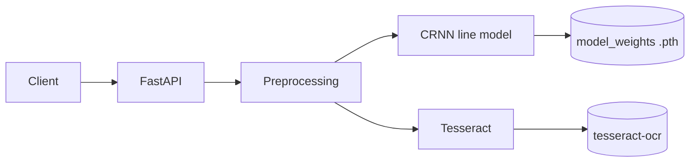

# Unified OCR API — handwriting (CRNN) + Tesseract

- Original handwriting project: [ocr-handwriting-recognition](https://github.com/shantanu-urgunde-21/ocr-handwriting-recognition)
- Line-level / Tesseract service: [ocr-revised](https://github.com/shantanu-urgunde-21/ocr-revised)

End-to-end **line-level OCR** in one service: a **PyTorch CRNN** for handwriting (IAM-style training) and **Tesseract** for printed text, behind **FastAPI**, with **full-page preprocessing** (deskew + line segmentation) or **single-line** mode.

I have attached an image in repo trial purpose.

**Portfolio samples:** see [`results/`](results/) for example API response JSON.

## What I built

- Merged two prior projects into a single pipeline: **segmentation + model choice per request**.
- **REST API** with `model_type` (`crnn` | `tesseract`) and `preprocessing_mode` (`full` | `single_line`).
- **Docker** image built from slim Python; **CRNN weights are not baked in**—mount `model_weights/` at runtime (keeps the repo cloneable without large binaries).
- **Tesseract** works without CRNN weights; **CRNN** returns `503` with a clear message if the checkpoint is missing.

## Stack

Python 3.10 · PyTorch · FastAPI · OpenCV · Pillow · Tesseract (system) · Docker

## Architecture



## Run with Docker

1. Place your checkpoint at `model_weights/handwriting_recognizer_best.pth` (file is gitignored; [`model_weights/.gitkeep`](model_weights/.gitkeep) keeps the directory).
2. From this directory:

```bash
docker compose up --build
```

### Option 2: Local Development

```bash
# 1. Install Tesseract (OS-specific)
# Windows: https://github.com/UB-Mannheim/tesseract/wiki
# macOS: brew install tesseract
# Linux: sudo apt-get install tesseract-ocr

# 2. Install Python dependencies
pip install -r requirements.txt

# 3. Place model weights
cp /path/to/handwriting_recognizer_best.pth model_weights/

# 4. Run the service
python -m api.fastapi_app

# 5. Test
curl http://localhost:8000/health
```

---

## Running Locally

### Prerequisites

- **Python 3.10+**
- **Tesseract OCR** (system binary)
  - **Windows**: Download [UB-Mannheim Tesseract](https://github.com/UB-Mannheim/tesseract/wiki/Downloads), install to `C:\Program Files\Tesseract-OCR`, then update `TESSDATA_PREFIX` in code if needed
  - **macOS**: `brew install tesseract`
  - **Linux**: `sudo apt-get install tesseract-ocr`
- **PyTorch & GPU support (optional)**: Install CUDA for faster inference

### Installation

```bash
# 1. Clone and navigate
cd ocr-merged

# 2. Create virtual environment
python -m venv venv
source venv/bin/activate  # On Windows: venv\Scripts\activate

# 3. Install dependencies
pip install -r requirements.txt

# 4. [Optional] GPU acceleration (if CUDA available)
pip install torch torchvision --index-url https://download.pytorch.org/whl/cu118

# 5. Place model weights
mkdir -p model_weights
cp /path/to/handwriting_recognizer_best.pth model_weights/
```

### Running

```bash
python -m api.fastapi_app
```

Service starts at `http://localhost:8000`

- **API Docs (Swagger):** `http://localhost:8000/docs`
- **Alternative Docs (ReDoc):** `http://localhost:8000/redoc`
- **Health Check:** `http://localhost:8000/health`

---

## Running with Docker

### Prerequisites

- **Docker** & **Docker Compose**
- **Model weights** at `model_weights/handwriting_recognizer_best.pth` (gitignored)

### Setup & Run

```bash
# 1. Build image
docker compose build

# 2. Start service
docker compose up

# 3. Test
curl http://localhost:8000/health

# 4. Stop
docker compose down
```

**View logs:**

```bash
docker compose logs -f api
```

**Run with GPU (if available):**
Uncomment the `runtime: nvidia` line in [`docker-compose.yml`](docker-compose.yml)

### Image Details

- **Base image:** `python:3.10-slim`
- **Dependencies:** Installed from [`requirements-docker.txt`](requirements-docker.txt) (headless/optimized)
- **Model weights:** Mounted at runtime from `./model_weights/` → `/app/model_weights/`
- **Tesseract:** Installed via system package manager in container

---

## API Endpoints

### 1. Health Check

```
GET /health
```

**Response:**

```json
{
  "status": "ok",
  "device": "cuda",
  "crnn_available": true,
  "tesseract_available": true
}
```

---

### 2. Models Info

```
GET /models-info
```

**Response:**

```json
{
  "models": [
    {
      "name": "crnn",
      "type": "handwritten_text_recognition",
      "available": true,
      "architecture": "CRNN with ResNet backbone",
      "training_data": "IAM Handwriting Database"
    },
    {
      "name": "tesseract",
      "available": true,
      "type": "general_text_recognition",
      "version": "5.x"
    }
  ]
}
```

---

### 3. OCR Prediction

```
POST /predict
```

**Form Parameters:**

```
- image (file): Image file (JPEG, PNG)
- model_type (string): "crnn" or "tesseract" [default: "tesseract"]
- preprocessing_mode (string): "full" (page-level deskew + segmentation) or "single_line" [default: "full"]
```

**Example cURL:**

```bash
curl -X POST "http://localhost:8000/predict" \
  -F "image=@sample_image.jpg" \
  -F "model_type=crnn" \
  -F "preprocessing_mode=full"
```

**Response (Success):**

```json
{
  "success": true,
  "model_type": "crnn",
  "preprocessing_mode": "full",
  "text": "The quick brown fox...",
  "lines": [
    { "text": "The quick brown", "confidence": 0.95 },
    { "text": "fox jumps over", "confidence": 0.92 }
  ],
  "confidence": 0.935,
  "inference_time_ms": 125.43
}
```

**Response (Error - Missing CRNN weights):**

```json
{
  "success": false,
  "error": "CRNN model weights not found at model_weights/handwriting_recognizer_best.pth. Please mount model weights or use tesseract model."
}
```

---

## Project Structure

```
ocr-merged/
├── api/
│   ├── __init__.py
│   ├── fastapi_app.py          # Main FastAPI application & endpoints
│   ├── routes.py               # Request routing & preprocessing logic
│   └── schemas.py              # Pydantic request/response models
├── models/
│   ├── __init__.py
│   ├── crnn_model.py           # CRNN architecture & inference
│   ├── model_registry.py       # Model factory & registry
│   └── tesseract_model.py      # Tesseract wrapper
├── preprocessing/
│   ├── __init__.py
│   ├── preprocessing.py        # Core preprocessing (deskew, normalization)
│   └── crnn_preprocessing.py   # CRNN-specific preprocessing
├── model_weights/              # Model checkpoint storage (gitignored)
│   ├── .gitkeep                # Keeps directory tracked
│   ├── handwriting_recognizer_best.pth
│   └── handwriting_recognizer_final.pth
├── notebooks/                  # Jupyter notebooks (training, experimentation)
│   ├── handwriting_recognition.ipynb
│   ├── handwriting_recognition_reinforcement.ipynb
│   └── prediction.ipynb
├── results/                    # Sample outputs & response documentation
│   ├── README.md
│   ├── sample_response_crnn.json
│   └── sample_response_tesseract.json
├── docker-compose.yml
├── Dockerfile
├── requirements.txt            # Development dependencies
├── requirements-docker.txt     # Production dependencies (Docker)
└── README.md                   # This file
```

---

## Development

### Training & Experimentation

Jupyter notebooks are provided for:

- **`handwriting_recognition.ipynb`** – Model training, evaluation, hyperparameter tuning
- **`handwriting_recognition_reinforcement.ipynb`** – Advanced training techniques
- **`prediction.ipynb`** – Test predictions with different models

### Adding Custom Models

1. **Create model class** in `models/custom_model.py`
2. **Register in `model_registry.py`**:
   ```python
   REGISTERED_MODELS = {
       "crnn": CRNNModel,
       "tesseract": TesseractModel,
       "my_model": MyCustomModel,  # Add here
   }
   ```
3. **Add preprocessing** (if needed) in `preprocessing/`
4. **Update API** to accept `model_type="my_model"`

### Testing

```bash
# Interactive testing via Swagger UI
open http://localhost:8000/docs

# Or use curl
curl -X POST "http://localhost:8000/predict" \
  -F "image=@test_image.jpg" \
  -F "model_type=tesseract"
```

### Code Style

- Python 3.10+
- Type hints encouraged
- Docstrings for public functions/classes
- Format with `black` (optional): `pip install black && black .`

---

## Troubleshooting

### Docker Build Fails

**Problem:** `ERROR: Could not find a version that satisfies pytesseract`

**Solution:** Ensure `requirements-docker.txt` is valid. Tesseract must be installed in the container:

```dockerfile
RUN apt-get update && apt-get install -y tesseract-ocr
```

### CRNN Model Returns 503

**Problem:** "Model weights not found"

**Solution:** Ensure model weights are placed at `model_weights/handwriting_recognizer_best.pth` before starting:

```bash
docker compose up --build
# Or for local: python -m api.fastapi_app
```

### Tesseract "Config Error"

**Problem:** `TesseractNotFoundError` or `ConfigError`

**Solution:** Tesseract not installed or not in PATH:

- **Windows:** Add to PATH: `C:\Program Files\Tesseract-OCR`
- **macOS/Linux:** Reinstall: `brew install tesseract` or `sudo apt-get install tesseract-ocr`

### Slow Inference

**Problem:** Predictions taking >1 sec

**Solution:**

- Ensure GPU is used: Check `device` in health endpoint response
- Reduce image resolution if very large
- Check system resources (CPU, RAM, GPU memory)

### Port Already in Use

**Problem:** `Address already in use :8000`

**Solution:**

```bash
# Find and kill process
lsof -i :8000  # macOS/Linux
netstat -ano | findstr :8000  # Windows

# Or use different port
python -m api.fastapi_app --port 8001
```

---

## Performance Tips

1. **Use GPU:** CUDA-enabled GPU reduces inference time ~5–10x
2. **Batch requests:** For high volume, consider implementing batch endpoint
3. **Cache preprocessing:** For repeated images, cache preprocessing results
4. **Optimize image size:** Resize large images before sending (typical: <2000 width)

---

## License

[Add your license here if applicable]

---

## Contact & Support

For issues, questions, or improvements, please open an issue on GitHub or contact the maintainer.

```bash
pip install -r requirements.txt
uvicorn api.fastapi_app:app --host 0.0.0.0 --port 8000 --reload
```

Use [`requirements.txt`](requirements.txt) if you also run training notebooks (`datasets`, `matplotlib`, etc.).

## API (summary)

| Method | Path          | Purpose                                                                                                              |
| ------ | ------------- | -------------------------------------------------------------------------------------------------------------------- |
| GET    | `/health`     | Status, device, available models                                                                                     |
| GET    | `/models`     | Model metadata                                                                                                       |
| POST   | `/ocr`        | Multipart: field **`files`** repeated for each image (`curl -F files=@a.png -F files=@b.png`)                        |
| POST   | `/ocr/single` | Multipart: one field **`file`** — use this from **Swagger UI** for a single image (avoids broken array file widgets) |

Query params on `POST /ocr`:

- `model_type`: `crnn` (default) or `tesseract`
- `preprocessing_mode`: `full` (deskew + line segmentation) or `single_line` (image already one line)

Examples:

```bash
# One or more files (same field name repeated)
curl -X POST "http://localhost:8000/ocr?model_type=crnn&preprocessing_mode=full" -F "files=@page.png"
curl -X POST "http://localhost:8000/ocr?model_type=tesseract&preprocessing_mode=full" -F "files=@a.png" -F "files=@b.png"

# Single file (also best match for /docs “Try it out”)
curl -X POST "http://localhost:8000/ocr/single?model_type=crnn" -F "file=@page.png"
```

Example response shapes: [`results/sample_response_crnn.json`](results/sample_response_crnn.json), [`results/sample_response_tesseract.json`](results/sample_response_tesseract.json).

## Project layout

```
ocr-merged/
├── api/                 # FastAPI app, routes, schemas
├── models/              # CRNN, Tesseract wrapper, registry
├── preprocessing/       # Page pipeline + CRNN line prep
├── model_weights/       # Mount or copy .pth here (not in git)
├── notebooks/           # Training / experiments
├── results/             # Portfolio sample JSON
├── requirements.txt     # Local + notebooks
├── requirements-docker.txt
├── Dockerfile
└── docker-compose.yml
```

## Troubleshooting

- **CRNN “weights not found”:** Add `handwriting_recognizer_best.pth` under `model_weights/` (or mount that directory in Docker).
- **Tesseract errors:** Ensure the `tesseract` binary is on PATH in the container (the Dockerfile installs `tesseract-ocr`) or configured on the host for local runs.
