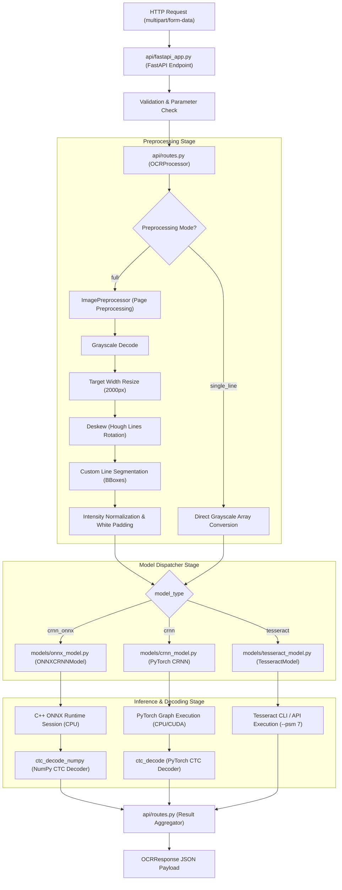

# Unified OCR System: Internal Flow of Execution

This document maps out the internal mechanics, execution sequences, and data transformations inside the Unified OCR System. Use this as an architectural reference for debugging, profiling, and adding new models.

---

## 1. High-Level Architectural Flow



---

## 2. Phase-by-Phase Execution Lifecycle

### Phase A: Application Initialization & Boot
When the FastAPI application boots (`uvicorn api.fastapi_app:app`):
1. **Dynamic Environment Check**: `fastapi_app.py` runs a dynamic import check on `torch`. If PyTorch is missing, the `DEVICE` fallback variable is set to `"cpu"`.
2. **Package Registration**: `models/__init__.py` loads package exports. If `torch` is absent, standard PyTorch bindings are assigned to `None` to prevent package-level initialization crashes.
3. **Weight File Auditing**: The `@app.on_event("startup")` handler checks the existence of:
   - Handwriting model binaries (`.pth` weights).
   - Compiled ONNX binaries (`.onnx` weights).
   - System Tesseract installation.
4. **Model Registry Initialization**: `ModelRegistry` caches active models lazily to minimize start-up latency.

---

### Phase B: Request Ingestion & Input Verification
When a client sends a request to `/ocr` or `/ocr/single`:
1. **Form Decoding**: FastAPI decodes the multi-part request body, loading raw file bytes.
2. **Parameters Scrutiny**: The service verifies if the requested `model_type` (`crnn_onnx`, `crnn`, `tesseract`) is registered and if the `preprocessing_mode` (`full`, `single_line`) matches constraints.
3. **Weight Availability Guard**: If the request targets a machine learning model, the endpoint checks if the model weights are present before launching the processor, throwing a structured `503 Service Unavailable` error if missing.
4. **Processor Dispatching**: The verified bytes are forwarded to the unified `OCRProcessor` container.

---

### Phase C: Preprocessing Pipeline Execution
Inside the `ImagePreprocessor` class (`preprocessing/layout_segmenter.py`), the request is split into isolated text line arrays:

#### 1. Page-Level Transformation (Only in `full` mode):
```
Raw Image Bytes ──> Grayscale Binarization ──> Rescale Width (2000px) ──> Hough Line Deskewing
```
- **Grayscale Conversion**: Eliminates color channels to normalize luminance.
- **Aspect-Ratio Resizing**: Resizes the image to `target_width=2000` to standardize text proportions.
- **Deskewing**: Uses Hough Line Transform (`cv2.HoughLinesP`) to compute the average text baseline tilt angle, then applies an affine rotation matrix to correct the tilt.

#### 2. Line Segmentation (Only in `full` mode):
- **Horizontal Projection Profile**: Calculates dark pixel densities horizontally across the page.
- **Bounding Box Isolation**: Identifies low-density boundaries (lines of whitespace) to separate paragraphs into individual lines.
- **Aspect-Ratio Splitter**: If a line width exceeds `max_line_width=1000`, the preprocessor cuts it into smaller segments to match the handwriting engine's spatial layout.

#### 3. Line Normalization & Padding:
- **Min-Max Stretching**: Normalizes values using `cv2.NORM_MINMAX` to stretch contrast levels.
- **Whitespace Padding**: Adds a 10px white border (`cv2.copyMakeBorder`) around each line. This ensures text characters do not touch boundary limits, which improves segmentation models and Tesseract line processing.

---

### Phase D: Model Execution Engines

#### Path 1: ONNX Handwriting Inference (`crnn_onnx`)
1. **NumPy Resizing**: `CRNNImagePreprocessor.from_numpy_numpy()` resizes the grayscale line segment to exactly `64 × 512` pixels using bilinear interpolation.
2. **Scaling & Normalization**: Scales values to $[0.0, 1.0]$ and shifts the distribution to $[-1.0, 1.0]$ with `(arr - 0.5) / 0.5`.
3. **C++ Execution**: Feeds the resulting `(1, 1, 64, 512)` NumPy float32 array into `onnxruntime.InferenceSession`. The model runs inside optimized C++ graphs.
4. **NumPy Decoding**: The sequence log probabilities are passed to `ctc_decode_numpy()`:
   * **Argmax collapse**: Collapses repeating consecutive predicted tokens.
   * **Blank removal**: Drops the CTC blank tokens (`CTC_BLANK = 0`).
   * **Character mapping**: Translates index positions to alphanumeric characters using the IAM-style dictionary vocabulary.

#### Path 2: Standard PyTorch Inference (`crnn`)
1. **Tensor Preparation**: `CRNNImagePreprocessor.from_numpy()` converts the image to a PyTorch tensor and executes the compiled `inference_transform`.
2. **Graph Evaluation**: In `api/routes.py`, `predict_text()` loads the model, switches the network into evaluation state (`model.eval()`), shifts the tensor to the configured `DEVICE` (CPU or CUDA), and evaluates the model inside a `torch.no_grad()` context.
3. **PyTorch Decoding**: Decodes predictions using PyTorch-based tensor operations (`ctc_decode()`).

#### Path 3: Tesseract Inference (`tesseract`)
1. **8-bit Normalization**: If the input image isn't integer-represented, `TesseractModel` rescales and casts the array: `(image * 255).astype(np.uint8)`.
2. **PSM Override**: Executes `pytesseract.image_to_string` using the `--psm 7` layout engine configuration. This forces Tesseract to bypass its own internal block analyzer and treat the line as a single line of printed text.

---

### Phase E: Result Formatting & API Response
1. **Consolidation**: The processor maps line texts back into an ordered JSON list (`LineResult`).
2. **Joining lines**: Joins individual text lines with newline characters (`\n`).
3. **Final Response rendering**: Wraps everything in a Pydantic schema model (`OCRResponse`), which logs metadata, inference durations, and processed line structures, sending a standard JSON response to the client.
